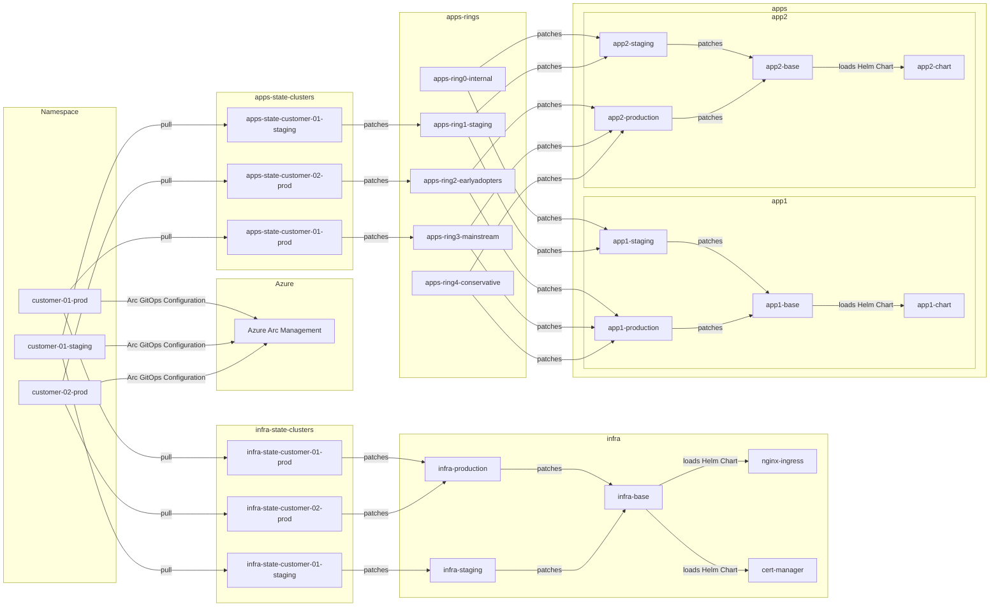

# gitops-flux-arc

```mermaid
graph LR
    subgraph Azure
        ArcManagement[Azure Arc Management]
    end

    subgraph Namespace
        customer-01-prod -->|Arc GitOps Configuration| ArcManagement
        customer-01-staging -->|Arc GitOps Configuration| ArcManagement
        customer-02-prod -->|Arc GitOps Configuration| ArcManagement
    end

    subgraph apps-state-clusters
        apps-state-customer-01-prod
        apps-state-customer-01-staging
        apps-state-customer-02-prod
    end

    subgraph infra-state-clusters
        infra-state-customer-01-prod
        infra-state-customer-01-staging
        infra-state-customer-02-prod
    end        

    subgraph apps-rings
        apps-ring0-internal
        apps-ring1-staging
        apps-ring2-earlyadopters
        apps-ring3-mainstream
        apps-ring4-conservative
    end

    subgraph infra
        infra-production -->|patches| infra-base
        infra-staging -->|patches| infra-base
        infra-base -->|loads Helm Chart| nginx-ingress
        infra-base -->|loads Helm Chart| cert-manager
    end

    subgraph apps
        subgraph app1
            app1-staging -->|patches| app1-base
            app1-production -->|patches| app1-base
            app1-base -->|loads Helm Chart| app1-chart
        end
        subgraph app2
            app2-staging -->|patches| app2-base
            app2-production -->|patches| app2-base
            app2-base -->|loads Helm Chart| app2-chart
        end
    end

    customer-01-prod -->|pull| apps-state-customer-01-prod
    customer-01-staging -->|pull| apps-state-customer-01-staging
    customer-02-prod -->|pull| apps-state-customer-02-prod

    customer-01-prod -->|pull| infra-state-customer-01-prod
    customer-01-staging -->|pull| infra-state-customer-01-staging
    customer-02-prod -->|pull| infra-state-customer-02-prod

    apps-state-customer-01-prod -->|patches| apps-ring3-mainstream
    apps-state-customer-01-staging -->|patches| apps-ring1-staging
    apps-state-customer-02-prod -->|patches| apps-ring2-earlyadopters

    infra-state-customer-01-prod -->|patches| infra-production
    infra-state-customer-01-staging -->|patches| infra-staging
    infra-state-customer-02-prod -->|patches| infra-production

    apps-ring0-internal -->|patches| app1-staging
    apps-ring1-staging -->|patches| app1-staging
    apps-ring2-earlyadopters -->|patches| app1-production
    apps-ring3-mainstream -->|patches| app1-production
    apps-ring4-conservative -->|patches| app1-production

    apps-ring0-internal -->|patches| app2-staging
    apps-ring1-staging -->|patches| app2-staging
    apps-ring2-earlyadopters -->|patches| app2-production
    apps-ring3-mainstream -->|patches| app2-production
    apps-ring4-conservative -->|patches| app2-production

```